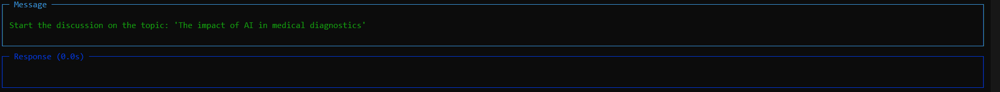

# Équipe d'Agents IA pour la Recherche Collaborative

## Description du Projet

Ce projet met en œuvre un système multi-agents utilisant le framework `agno`. Il simule une équipe de quatre agents IA spécialisés (chercheurs pour Reddit, HackerNews, articles académiques et Twitter) qui collaborent en temps réel pour analyser un sujet complexe et produire une synthèse.

Ce projet a été personnalisé et configuré par Khadija HIMRI.

## Démonstration

Voici un aperçu de l'équipe d'agents en cours d'exécution, collaborant sur un sujet de recherche :



## Fonctionnalités

- **Agents Spécialisés** : Chaque agent a un rôle et des outils uniques pour sa source d'information.
- **Collaboration en Temps Réel** : Les agents discutent et partagent leurs découvertes pour arriver à un consensus.
- **Modèle Utilisé** : Le système est alimenté par le modèle GPT-4o d'OpenAI.

## Instructions d'Installation et d'Utilisation

1.  **Cloner le repository (ou télécharger les fichiers).**

2.  **Installer les bibliothèques nécessaires :**
    ```bash
    pip install -r requirements.txt
    ```

3.  **Configurer la clé API OpenAI :**
    ```bash
    set OPENAI_API_KEY=VOTRE_CLÉ_API_SECRÈTE_ICI
    ```

4.  **Lancer le script :**
    ```bash
    python agent_team_app.py
    ```